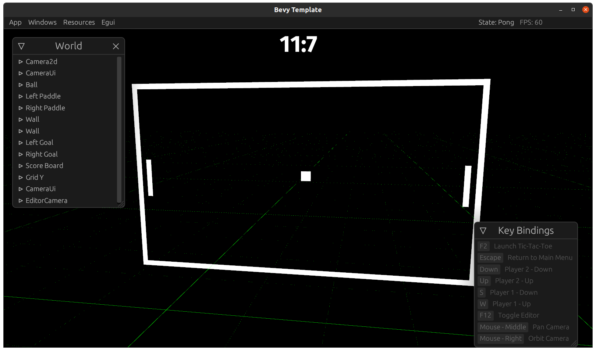

# Bevy Template

(Currently this is the most complex version on pong in the universe.)

I am learning rust and [bevy](https://github.com/bevyengine/bevy) and this is my latest playground.

I hope to turn this into template using all the amazing work in the bevy communty. Would this be allowed in a [bevy game jam](https://github.com/bevyengine/bevy/discussions/2364)?

## Editor

I have started an editor plugin, a hack job, just me playing around.

After years of messing around in Unity and writting some of my own editor inspectors its amazing what you can already put together in bevy.


~Yes, I know the Anti-aliasing is a problem, its not beyv that was me, going to place all that code~

## Setup

Uses nightly tool chain.

Be sure to follow the [Bevy Setup Guide](https://bevyengine.org/learn/book/getting-started/setup/) first.

## Personal Notes

For now I am using [Egui](https://github.com/emilk/egui) an immediate mode GUI library for Rust, its been has great so far.  You can still use Bevy UI though.

I started this after seeing [NiklasEi template](https://github.com/NiklasEi/bevy_game_template)
## Latest

// TODO: Add WASM Demo link and build downloads releases automatically

## Used Bevy Communtiy Plugins

* [bevy_egui](https://github.com/mvlabat/bevy_egui) provides a [Egui](https://github.com/emilk/egui) integration
* [bevy-inspector-egui](https://github.com/jakobhellermann/bevy-inspector-egui) Creates egui window inspectors of any data we want.
* [bevy_kira_audio](https://github.com/NiklasEi/bevy_kira_audio) audio  manager, integrates [Kira](https://github.com/tesselode/kira/) into Bevy.
* [bevy_mod_picking](https://github.com/aevyrie/bevy_mod_picking) plugin for 3D mouse picking
* [bevy_asset_loader](https://github.com/NiklasEi/bevy_asset_loader) reduces boilerplate when loading game assets
* [bevy_input_actionmap](https://github.com/lightsoutgames/bevy_input_actionmap)
* [bevy_skybox] - A skybox plugin

Dev

* [bevycheck](https://github.com/jakobhellermann/bevycheck) provides some handy debug information
## Github Features

This repo has a [release workflow](.github/workflows/release.yaml) setup that will build releases and publish them on github.com

For more information see [Workflow and Tags](docs/workflows.md)

## Tricks

It can be hard to figure out what crate is using what version of bevy, this command was finally how i tracked it down

```bash
cargo tree --format "{p}{r}" | grep --color=always -e "^" -e "bevy#d8"
```
