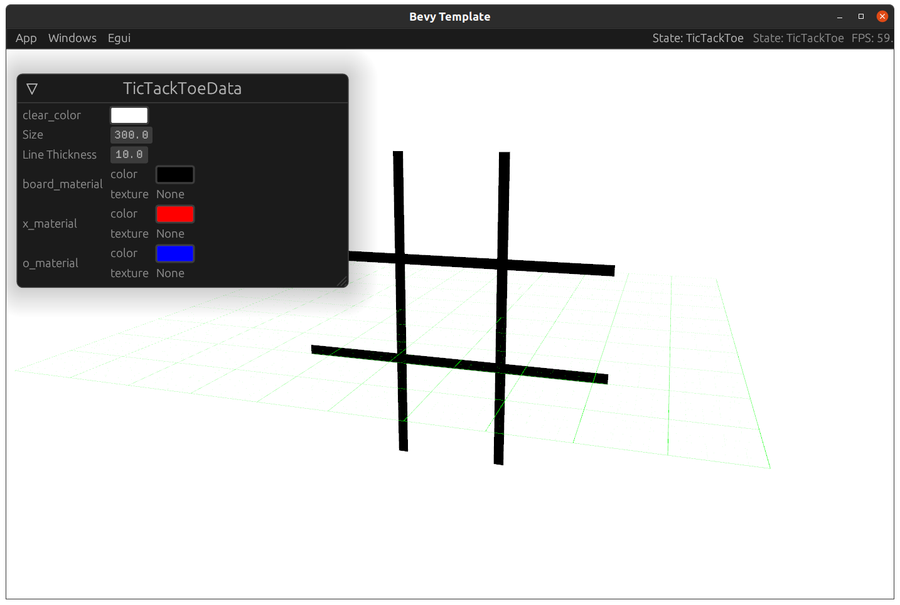

# Bevy Template

(Currently this is the most complex version on pong in the universe.)

This project is a playground where I try out different way of doing things in bevy, something more than a simple scene,

This is a project template using bevy and cummunity plugins.

This will be a framework for myself and where I figure out how to use existing solutions.

Would this be allowed in a game jam? I really hope so.



## Setup

Uses nightly tool chain.

Be sure to follow the [Bevy Setup Guide](https://bevyengine.org/learn/book/getting-started/setup/) first.

## Personal Notes

*UI in bevy is alot of work and not very complete, good news is that like all of bevy people far smarter than me are working on it.*
For now though everything will be using [Egui](https://github.com/emilk/egui) immediate mode GUI library for Rust, its been has great so far.

I started the workflow stuff based on [NiklasEi template](https://github.com/NiklasEi/bevy_game_template), it had web support using bevy_webgl2.
I have removed it for now, though I do plan on adding it back.  I want to look into bevy_webgl2.

## Latest release

// TODO: Add links to releases automatically

## Current Plugins

* [bevy_egui](https://github.com/mvlabat/bevy_egui) provides a [Egui](https://github.com/emilk/egui) integration
  * Checkout [egui_demo](https://github.com/emilk/egui/tree/master/egui_demo_lib/src/apps) for some amazing examples
* [bevy-inspector-egui](https://github.com/jakobhellermann/bevy-inspector-egui) Creates egui window inspectors of any data we want.
* [bevy_kira_audio](https://github.com/NiklasEi/bevy_kira_audio) audio  manager, integrates [Kira](https://github.com/tesselode/kira/) into Bevy.  bevy_audio is
* [bevy_mod_picking](https://github.com/aevyrie/bevy_mod_picking) plugin for 3D mouse picking
* [bevy_asset_loader](https://github.com/NiklasEi/bevy_asset_loader) reduces boilerplate when loading game assets
* [bevycheck](https://github.com/jakobhellermann/bevycheck) provides handy debug information for bevy systems
  * put ```#[bevycheck::system]``` above a system to get some helpful debugging information(remove after use, will panic if you leave it in)
* [bevy_skybox]

## Github Features

This repo has a [release workflow](.github/workflows/release.yaml) setup that will build releases and publish them on github.com

For more information see [Workflow and Tags](docs/workflows.md)

## Tricks

It can be hard to figure out what crate is using what version of bevy, this command was finally how i tracked it down

```bash
cargo tree --format "{p}{r}" | grep --color=always -e "^" -e "bevy#d8"
```
